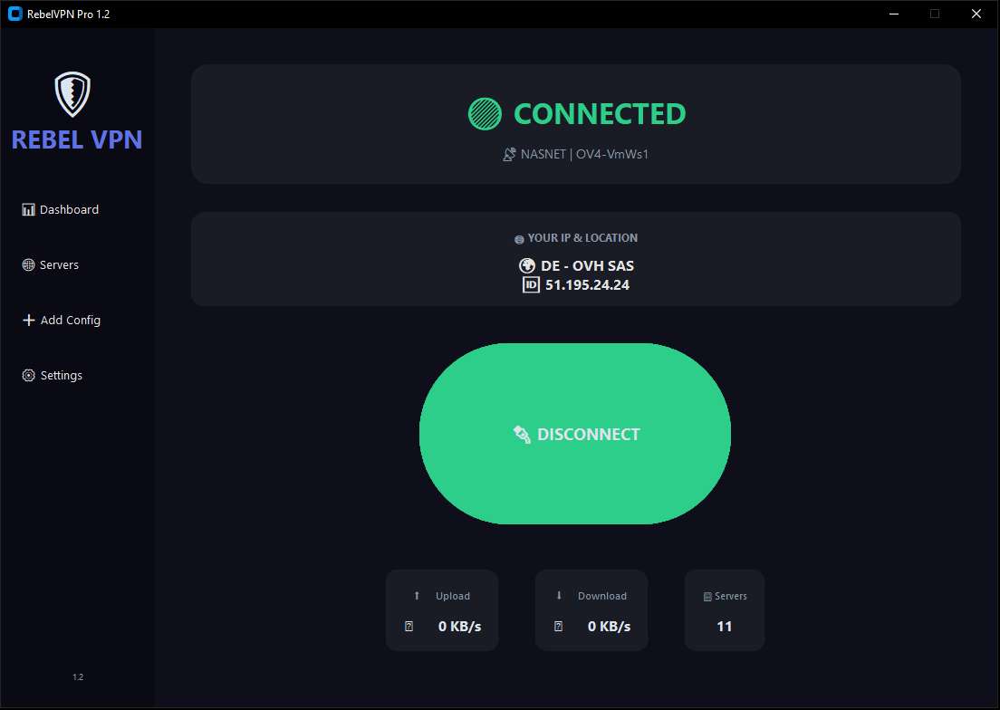

# 🛡️ RebelVPN Pro
<a href="https://github.com/Arianlavi/RebelVPN-Pro/releases/download/v1.2.0/V1.2.zip">
  
</a>




**Powerful, Modern & Open-Source VPN Client for Windows**  
**کلاینت وی پی ان قدرتمند، مدرن و متن‌ باز برای ویندوز**

Supports **Xray** and **Sing-box** natively • Built for speed and privacy  
پشتیبانی کامل و مستقیم از (Xray و Sing-box)

[](https://github.com/Arianlavi/RebelVPN-Pro/releases)
[](https://github.com/Arianlavi/RebelVPN-Pro/releases)
[](https://www.microsoft.com/windows)
[](LICENSE)
[](https://github.com/Arianlavi/RebelVPN-Pro/stargazers)

---

## ✨ Features | ویژگی‌ ها

| Feature | توضیحات |
|--------|--------|
| 🔌 **Multiple Protocols** | VLESS • VMess • Trojan • Shadowsocks • SOCKS |
| 🚀 **Sing-box & Xray Native** | Run Sing-box/Xray configs directly without conversion |
| ⚡ **Ultra-Fast Connection** | Automatic lowest-latency server selection |
| 🌐 **System Proxy Integration** | Automatically sets Windows proxy on connect |
| 📊 **Real-time Traffic Monitor** | Live upload/download speed & data usage |
| 🎨 **Modern Dark UI** | Built with CustomTkinter – clean and intuitive |
| 🔍 **Smart Search & Filter** | Quickly find servers by name or tag |
| 📱 **Subscription Support** | Import from URL, Google Drive, or manual config |
| 💾 **Auto-save Everything** | Never lose your configs again |

---

## 📥 Download | دانلود

### Latest Version (Recommended)
[](https://github.com/Arianlavi/RebelVPN-Pro/releases/download/v1.2.0/V1.2.zip)

> No installation required • Just download and run  
> بدون نیاز به نصب • فقط دانلود کنید و اجرا کنید

---

## 🚀 Quick Start | راه‌ اندازی سریع

### Method 1: Portable EXE (Recommended)
1. Download from the button above ↑
2. Run `RebelVPN-Pro.exe` (as Administrator recommended)
3. Enjoy!

### Method 2: Run from Source
```bash
git clone https://github.com/Arianlavi/RebelVPN-Pro.git
cd RebelVPN-Pro

python -m venv venv
venv\Scripts\activate

pip install -r requirements.txt

# Place xray.exe and sing-box.exe in folder
python main.py
```

### Method 3: Build Your Own EXE
```bash
pip install pyinstaller
pyinstaller --onefile --windowed --icon=resources/icon.ico --name "RebelVPN-Pro" main.py
# Then copy xray.exe and sing-box.exe into dist/
```

---

## 🛠️ Requirements | پیش‌ نیازها

- **OS**: Windows 10 / 11 (64-bit)
- **Python**: 3.8+ (only if running from source)
- **Cores** (required):
  - [Xray-core](https://github.com/XTLS/Xray-core/releases)
  - [sing-box](https://github.com/SagerNet/sing-box/releases)

> Just drop `xray.exe` and `sing-box.exe` into the folder

---

## 🤝 Contributing | مشارکت

We welcome contributions! Here's how you can help:

```bash
git clone https://github.com/Arianlavi/RebelVPN-Pro.git
git checkout -b feature/your-amazing-feature
# Make your changes
git commit -m "feat: add amazing feature"
git push origin feature/your-amazing-feature
```

Then open a Pull Request!

### Wanted Features
- [ ] Light/Dark mode toggle
- [ ] System tray icon & minimize to tray
- [ ] Built-in speed test
- [ ] Multiple profiles support
- [ ] Subscription with authentication

---

## ❓ FAQ | سوالات متداول

**Q: Why won't it start?**  
A: Make sure `xray.exe` and `sing-box.exe` are in the folder.

**Q: Connection failed?**  
A: Run as **Administrator** • Check `app.log` • Ensure ports 10808-10809 are free.

**Q: Is it safe?**  
A: **100% Open Source** • No telemetry • No external connections • Auditable code.

---

## 📄 License | مجوز

Released under the **MIT License** — free for personal and commercial use.  
See [LICENSE](LICENSE) for details.

---

## 👨‍💻 Contact | تماس

- GitHub: [@Arianlavi](https://github.com/Arianlavi)
- Telegram: [@Rebeldevx](https://t.me/@rebeldevx)

---

<div align="center">

**Made with ❤️ for free internet — برای اینترنت آزاد**

<br/>

[](https://star-history.com/Arianlavi/RebelVPN-Pro)

**اگر این پروژه براتون مفید بود، لطفا یک ستاره ⭐ بزنید!**

<br/>


</div>
